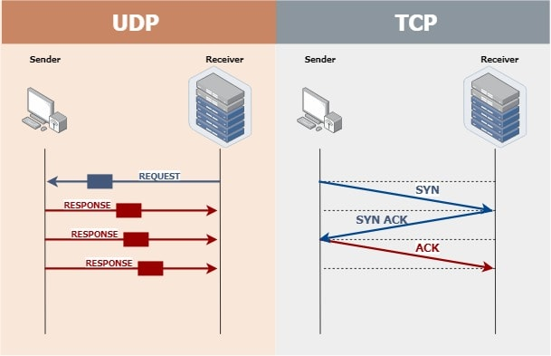

# Lecture note for 09-29

## Berkeley Socket API

- Similar to Unix file I/0 API

  - in the form of file descriptor (sort of handle)
  - Can share the same read()/write()/close() system calls

### What is a socket?

- The point where a local application attaches to the network
- An interface between an application and the transport protocol
- An application creates the socket

The interface defines operations for

- Creating a socket
- Attaching a socket to the network
- Sending and receiving messages through the socket
- Closing the socket

Sockets are where your program send and receive data

- Endpoint of a connection
  - Identified by IP address and Port number
- Primitive to implement high-level networking interfaces
  - e.g., Remote procedure call (RPC), HTTP, Video streaming, etc.
    

## Internet Delivery Model

### IP

- Send and receiepackets of data, up to 64 kb in size, though 1500 bytes is the norm
- Connection-less
- "Best-effort delivery"
  - Arbitraty order of packet delivery
  - Packets can be lost, and there is no automatic retransmission
  - Posssible duplicates
  - Packets can get corrupted during transit

## Types of sockets

### TCP

- Connnection-oriented
  - Requires connection establishment and termination
  - Interface: infinite bytestream
  - Reliable delivery
    - In-order delivery
    - Retransmission
    - No duplicates
  - High variance in latency
    - Cost of the reliable service
  - Eg. HTTP,SSH, FTP

### UDP

- Connection-less
- "Best-effort" delivery
  - Arbitrary order of packet delivery
  - No retransmission
  - Possible duplicates
  - Might not get to the accurate destination
- Low variance in latency
- Packet-like interface
  - Requires packeting
- Eg. DNS (Domain name system), VoIP, VOD
  - Not doing retransmission, packets could be delivered to the application right away
  - Handle the lost at the application



> Connection-oriented: for TCP, needs to open a connection, permission-like; At least one round-trip time.

- Might not get to the accurate location

## Example to practice:

time.go:

```go
package main
import (
    "log"
    "bytes"
    "os"
    "fmt"
    "net"
    "io"
)
func main(){
    if len(os.Args) != 2{
        log.Fatalf("Usage: %s host:port", os.Args[0])
    }
    service := os.Args[1]

    log.Printf("Sending to %s", service)

    conn, err := net.Dial("tcp", service)
    checkError(err)

    log.Printf("Connected to %s", service)

    result, err := readFully(conn) //keep reading from the connection until the other end closes it

    checkError(err)
    fmt.Println(string(result))

}
func readFully(conn net.Conn) ([]byte, error){
    result := bytes.NweBuffer(nil)
    var buf [512]byte //an array of 512 bytes
    for {
        //arrays we create in memory
        //slices: a slice pointer that points to the array, track the length and capacity
        //take the slice into the buffer
        //return the number of bytes
        //read starting from position zero
        //when it returns, might have read somewhere between (maybe 300 bytes)
        //return how many bytes that actually been read
        n, err := conn.Read(buf[0:])
        result.Write(buf[0:n])

        if err != nil {
            if err == io.EOF {
                break
            }
            return nil, err
        }
    }
    conn.Close()
    return result.Bytes(), nil
}
func checkError (err error) {
    if err != nil {
        log.Fatalf("Fatal error :%s", err.Error())
    }
}
```

Run the code connecting to the server:

```go
go run time.go time.nist.gov:13
```

### On the server side:

- need to tell the OS that we need to accept the connection on which port (port 13 for instance)

timequery.go

```go
package main
import(
    "net"
    "conn"
    "log"
    "bytes"
    "os"
    "fmt"
    "io"
)
func main(){
    //tcp, port 13
    //notify the OS that we want to receive connection from this port
    net.Listen("tcp", ":13000")
    checkError(err)
    log.Printf("ready to listen on port 13000")
    for{
        conn,err := listener.Accept()
        log.Printf("Accepted a new connection")

        if(err != nil){
            //maybe just one client has a problem
            continue
        }

        daytime := time.Now().String()
        conn.Write([]byte(daytime))
        conn.Close()
    }
}
func checkError (err error) {
    if err != nil {
        log.Fatalf("Fatal error :%s", err.Error())
    }
}

```

```go
go.run timequery.go 127.0.0.1:13000
```

INITIALLY: THE LOWER-LEVEL C INTERFACE
THEN: THE SAME INTERFACE BUT IN GO

## CLIENT AND SERVER SOCKETS (SYSTEM CALLS)
