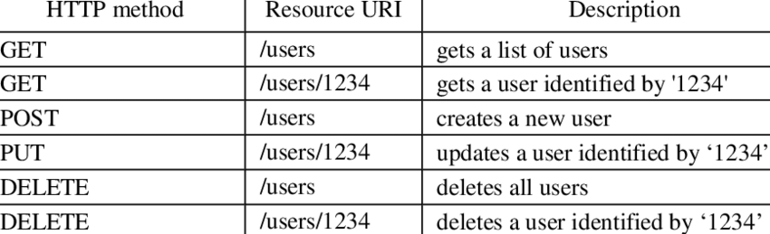
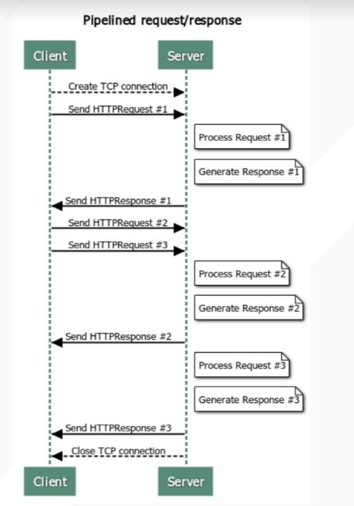

# HTTP Overview

## Documents link to other documents

- Specified in HTML files
- HTTP is the protocol for retrieving

HTML files from servers

- and images, sounds, video, ...
- Implemented in servers
- Apache, nginx, MSFT IIS
- and clients
- Chrome
- MSFT Edge
- Apple Safari...

## Steps that occur when a link is selected:

- Browser determines the URL
- Browser asks DNS for the IP address of the server
- DNS replies
- Browser opens a TCP connection
- Sends HTTP request for the page
- Server sends the page as HTTP response
- Browser fetches other URLs as needed
- Browser displays the page
- The TCP connections are released

## HTTP is a text oriented protocol.

- HTTP is a request/response protocol
- Requests and responses both look like:

```
START_LINE <CRLF>
MESSAGE_HEADER <CRLF>
<CRLF>

MESSAGE_BODY <CRLF>
```

> The first line (START LINE) indicates whether this is a request message or a response message.

## Request Messages define

- The operation (called method) to be performed
- The web page the operation should be performed on
- The version of HTTP being used.

### Examples:

- GET /index.html HTTP/1.0
- GET /images/catimg23.jpg HTTP/1.1
- GET /contracts/contract3.txt HTTP/1.1



> POST: send the content of a form to a server

## • After the start line are request headers:

- Text-based, key and value separated by a colon

### Example 1:

```
GET /index.html HTTP/1.0
User-Agent: Firefox 23.3.1
```

### Example 2:

```
GET /images/cat2.jpg HTTP/1.1
Host: www.cs.ucsd.edu
User-Agent: Chrome 12.1
```

> Important to notice: a particular bug in a specific version of the browser, the server could work on this browser

> Virtual hosting feature, therefore must specify the Host name.

> server process the request using only the information from another request, if sending multiple requests to the server, even with just one TCP,

> Content type (eg. image, html file) and content header () are important

### Also begins with a single START LINE.

The version of HTTP being used, A three-digit status code, text description of the code

- Example:

```
HTTP/1.1 200 OK
Content-Type: text/html
Content-Length: 291 (bytes for an HTML file)
```

```
1xx - information
2xx - Sucess
3xx - Redirection
4xx - Client error
5xx - Server error
```

> 200, 400, 404 pages for Project 3
> Usually the client is the web browser (?)
> Caches and proxy, could acess client, inside client and server
> Cache could be the server,

## DESIGNING YOUR SERVER

Steps the server performs in its main loop:

- Accept a TCP connection from a client (a browser)
- Get the path to the page, which is the name of the file requested
- Get the file (from disk)
- Send an HTTP header then contents of the file to the client
- Release the TCP connection

Modern Web servers have more features

For dynamic content

- Third step may be replaced by the execution of a program that generates and returns the contents

## HTTP/1.0 opened a new connection

for every data item it retrieved

- Overhead in establishing a new
  connection to the same server over
  and over again
- HTTP/1.1 Persistent Connections
- Reuse connection over many
  requests/responses
- But more complex in terms of
  framing/parsing
  - How to know when one request
    ends and the next begins?
  - This is part of the 1.1 spec



> hexdump -c reqtxt

> nc command
> Here is an example, the -z option sets nc to simply scan for listening daemons, without actually sending any data to them. The -v option enables verbose mode and -w specifies a timeout for connection that can not be established.
