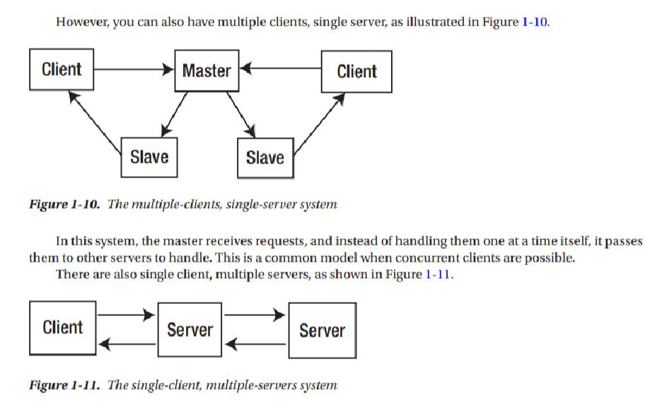

# CSE 124 Reading Notes

## Table of Contents

- [Week 1 Lecture 2](09-27.md)
- [Week 1 Lecture 3](09-29.md)
- [Week 2 Lecture 4](10-04.md)
  - [Week 2 Discussion](10-05%20DI.md)
- [Week 2 Lecture 5](10-06.md)

# Chapter 1 Architectural Layers

## Protocol Layers

The common way to deal with complexity is to break it down into smaller and simpler parts. These
parts have their own structure, but they also have defined means of communicating with other related parts.

In distributed systems, the parts are called protocol layers, and they have clearly defined functions. They
form a stack, with each layer communicating with the layer above and the layer below. The communication
between layers is defined by protocols.

### ISO OSI Protocol

- The Physical layer conveys the bit stream using electrical, optical, or radio technologies.
- The Data Link layer puts the information packets into network frames for transmission across the Physical layer and back into information packets
- The Network layer provides switching and routing technologies.
- The Transport layer provides transparent transfer of data between end systems and is responsible for end-to-end error recovery and flow control.
- The Session layer establishes, manages, and terminates connections between applications.
- The Presentation layer provides independence from differences in data representation (e.g., encryption).
- The Application layer supports application and end-user processes.

A layer in the OSI model often maps to a modern protocol; for example,

- the IP from TCP/IP maps to the
  Network layer, also known as layer 3 (Physical is layer 1).
- The Application layer, layer 7, maps to HTTP.
  Some protocols like HTTPS seem to blend layers, 5 (Session) and 6 (Presentation).
  No model is perfect; alternatives exist to the OSI model that maps closer to a given reality, such as the TCP/IP protocol model.

### TCP/IP Protocol

### Networking

A network is a communications system for connecting end systems called hosts. The mechanisms of
connection might be copper wire, Ethernet, fiber optic, or wireless, but that won’t concern us here. A local area network (LAN) connects computers that are close together, typically belonging to a home, small
organization, or part of a larger organization.

A wide area network (WAN) connects computers across a larger physical area, such as between cities.
There are other types as well, such as MANs (metropolitan area networks), PANs (personal area networks), and even BANs (body area networks).

### Gateaways

A gateway is a generic term for an entity used to connect two or more networks. A repeater operates at
the Physical level and copies information from one subnet to another. A bridge operates at the Data Link
layer level and copies frames between networks. A router operates at the Network level and not only moves information between networks but also decides on the route.

### Host-Level Networking

On a single host, we have additional concerns when designing, debugging, or deploying network-based
software. Some of these items include the following:

- DNS (domain name system, i.e., human-friendly naming)
- Firewalls (e.g., blocking inbound or outbound traffic)
- Routing (e.g., figuring out which network to place a packet)
- Host Identity management (e.g., IP address)
- Performance controls (e.g., traffic shaping or retries)
- Connection issues (e.g., missing network adapter, intramachine process
  communication)

### Packet Encapsulation

For example, the TFTP (Trivial File Transfer Protocol) moves files from one computer to another. It uses the UDP protocol on top of the IP protocol, which may be sent over ethernet. This looks like the diagram shown below:

### Connection Models

In order for two computers to communicate, they must set up a path whereby they can send at least one
message in a session. There are two major models for this:

- Connection oriented
  A single connection is established for the session. Two-way communications flow along the connection.
  When the session is over, the connection is broken. The analogy is to a phone conversation. An
  example is TCP.

- Connectionless
  Messages do not have an impact on each other. An
  example is the IP protocol. UDP is a connectionless protocol above IP and is often used as an alternative to
  TCP, as it is much lighter weight. Connectionless is also known as unconnected or stateless.

Connection-oriented transports may be established on top of connectionless ones – TCP over IP. Connectionless transports may be established on top of connection-oriented ones – HTTP over TCP.

Messages over a connection-oriented transport protocol have some kind of relation, for example, a sequence number used to keep order. Having state allows for functionality and optimizations; it also has an associated cost of storage and computing

## Communications Models

In a distributed system, there will be many components (i.e., processes) running that have to communicate
with each other. There are two primary models for this, message passing and remote procedure calls. In
the context of networking, these models allow interprocess (and/or thread) communication with intent to
invoke behavior on the remote process.

### Message Passing

Some languages are built on the principle of message passing. Concurrent languages (and tools) often use
such a mechanism, and the most well-known example is probably the UNIX pipeline. The UNIX pipeline
is a pipeline of bytes, but this is not an inherent limitation: Microsoft’s PowerShell can send objects along
its pipelines, and concurrent languages such as Parlog can send arbitrary logic data structures in messages
between concurrent processes. Recent languages such as Go have mechanisms for message passing
(between threads).

Message passing is a primitive mechanism for distributed systems. Set up a connection and pump some
data down it. At the other end, figure out what the message was and respond to it, possibly sending messages
back.

Event-driven systems act in a similar manner. At a low level, the programming language node.js runs an event loop waiting for I/O events, dispatching handlers for these events and responding.

At a higher level, most user interface systems use an event loop waiting for user input, while in the networking world, Ajax uses the XMLHttpRequest to send and receive requests.

### Remote Procedure Call

There are many examples of this: some based on particular programming languages such as the Go rpc package (discussed in Chapter 13) or RPC systems covering multiple languages such as SOAP and Google’s gRPC.

It may not be clear how message passing and RPC differ. At one level, they both are involved with invoking behavior “somewhere else.” Generally speaking, RPC tends to be less abstract (i.e., looks and feels like regular procedure calls) compared to message passing where we could be calling remote queueing system. Under the hood though, RPC will be passing message.

## Distributed Computing Models

The most common occurrence is an asymmetric one: a client sends requests to a server, and the server responds. This is a client-server system.

If both components are equivalent, both able to initiate and to respond to messages, then we have a
peer-to-peer system. Note that this is a logical classification: one peer may be a 16,000-core supercomputer;
the other might be a mobile phone. But if both can act similarly, then they are peers.

### Client-Server System

### Client-Server Application

### Server Distribution

However, you can also have multiple clients, single server, as illustrated in Figure 1-10.

In this system, the master receives requests, and instead of handling them one at a time itself, it passes
them to other servers to handle. This is a common model when concurrent clients are possible.
There are also single client, multiple servers, as shown in Figure.

This type of system occurs frequently when a server needs to act as a client to other servers, such as a business logic server getting information from a database server. And of course, there could be multiple clients with multiple servers.

Again, these components may or may not be on the same physical hardware.

## Communication Flows

###f Synchronous Communication

In a synchronous communication, one party will send a message and block, waiting for a reply. This is often
the simplest model to implement and just relies on blocking I/O. However, there may need to be a timeout
mechanism in case some error means that no reply will ever be sent.

### Asynchronous Communication
